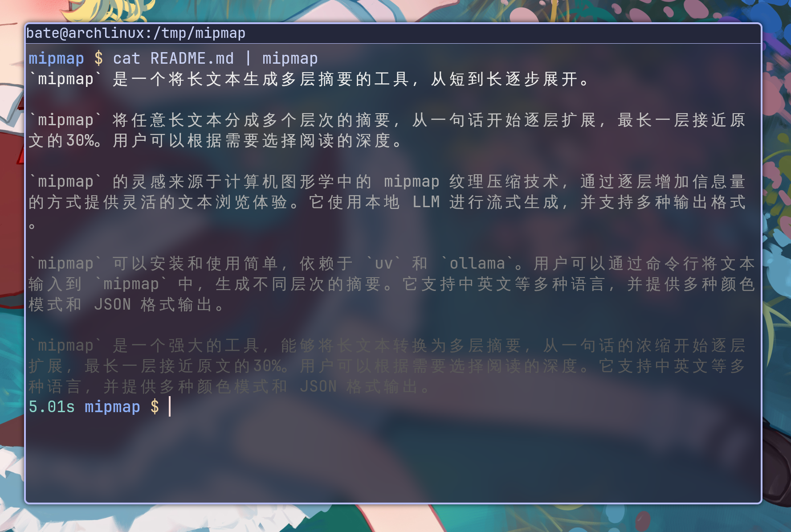

# mipmap

> 渐进式 TLDR——让长 AI 回答和长文章变得可以"快速浏览"。



`mipmap` 把任意一段长文本变成一组由短到长的摘要：从一句话的浓缩开始，每一层在前一层基础上翻倍展开，最长一层接近原文的 30%。读者从最短的开始扫，觉得够了就停，想了解更多就继续往下读。整套过程由本地 LLM（默认是 ollama 上的 qwen2.5-coder:14b）流式生成，最短的 TLDR 大约 1 秒就能看到。

灵感来自计算机图形学里的 mipmap 纹理压缩——每一级的分辨率是上一级的一半。文本的"分辨率"则用词数（英文）或字符数（中文）衡量。

## 为什么做这个

跟 AI 对话经常拿到几百到上千词的长回答，一眼读不完；想知道大意又不想全读，直接说"TL;DR"又只能拿到一句话——想再多看一点没办法。读博客、Wikipedia、技术文章也是同样的问题：固定长度的摘要总是要么太短要么太长。

mipmap 的思路是把"摘要的详细程度"做成一条连续的滑动条：从一句话的标题级开始，每往下一层信息量翻倍，你想读多深就读多深。读到觉得够了，Ctrl-C 走人。

## 安装

依赖：

- [`uv`](https://github.com/astral-sh/uv)（脚本通过 uv-script shebang 自管 Python 环境）
- 一个 LLM 后端，二选一：
    - [`ollama`](https://ollama.com) 跑本地模型（默认路径），拉一个支持中英双语的：
      ```bash
      ollama pull qwen2.5-coder:14b
      ```
    - 或者任何 OpenAI 兼容的服务（OpenAI、OpenRouter、vLLM 等），见下方 [用 OpenAI 或其他云端模型](#用-openai-或其他云端模型)。这种情况下不需要装 ollama。

把脚本拉下来，建个软链就好——`mipmap.py` 是一个单文件 uv-script，第三方依赖为零：

```bash
git clone https://github.com/archibate/mipmap.git
cd mipmap
chmod +x mipmap.py
ln -s "$PWD/mipmap.py" ~/.local/bin/mipmap
```

确认 `~/.local/bin` 在 `$PATH` 里就能直接用 `mipmap`。

## 使用

最简单的用法——把 stdin 喂给它：

```bash
cat article.md | mipmap
```

或者传文件路径：

```bash
mipmap article.md
```

输出格式默认是 `auto`：在终端里直接看就用 `color-256`，被管道接走或检测到 `NO_COLOR` 时降级为 `plain`，机器解析需要 `jsonl` 时显式指定即可。

```bash
mipmap article.md                 # auto：终端里渲染 color-256，piped 自动降级为 plain
mipmap article.md -f plain        # 原始：带 --- LEVEL N --- 分隔符，方便管道处理
mipmap article.md -f color        # 16 色：第一层最亮，往下逐渐变暗
mipmap article.md -f color-256    # 256 色渐变：从亮到暗的平滑过渡
mipmap article.md -f jsonl        # 每层一个 JSON 对象，方便机器解析
```

`color` 模式会把分隔符直接隐去，完全靠颜色区分层级——L1 最亮，往下按层数均匀变暗，最暗的层依然可读（不会褪进背景色）。视觉上就像图形学里的 mipmap 一样自然衰减。

### 实际效果

跑 Paul Graham 的《Founder Mode》（约 1250 词）：

```
$ mipmap founder-mode.txt -f color-256 -v
mipmap: source 1247 words, computing 5 levels: 20, 50, 125, 312, 374 (ollama/qwen2.5-coder:14b, num_ctx=16384 from modelfile (qwen2.5-coder:14b))

[最亮]  Founder mode, distinct from manager mode, is crucial for scaling
        startups effectively.

[较亮]  Founder mode involves direct CEO involvement and differs significantly
        from conventional management practices...

[正常]  Founders like Brian Chesky discovered that running a company in founder
        mode—inspired by leaders like Steve Jobs—yielded better results than
        following conventional wisdom...

[较暗]  Founder mode breaks the principle of CEOs engaging only through direct
        reports, advocating for skip-level meetings and annual retreats...

[最暗]  The concept of founder mode is still emerging, with limited literature
        or formal understanding. Founders have achieved significant success
        despite bad advice...
```

只读到第一层就够了的话，Ctrl-C 走人即可。

### 用 OpenAI 或其他云端模型

不想跑本地模型，或者想用更强的远端模型？切到 `--provider openai` 即可——除了真正的 OpenAI，任何兼容 `/v1/chat/completions` 的服务都能用：

```bash
# OpenAI
export OPENAI_API_KEY=sk-...
mipmap article.md --provider openai -m gpt-4o-mini

# OpenRouter / Together / Groq / DeepSeek 等
export OPENAI_API_KEY=...
mipmap article.md --provider openai \
    -e https://openrouter.ai/api/v1 \
    -m anthropic/claude-3.5-sonnet

# 本地 openai 兼容服务（vLLM / llama.cpp server / LM Studio），通常不需要 key
mipmap article.md --provider openai -e http://localhost:8080/v1 -m my-model
```

`num_ctx` 在 openai 路径下只用于 `--max-chars` 输入预算计算（不会发到请求里），默认 32K——上下文更大的模型可以用 `--num-ctx 131072` 之类显式调高。

### 中文支持

支持中文（以及日韩 CJK 文字）。无需特别配置——CJK 字符占比超过 50% 时自动按字符计长度（最短一层默认 30 字，英文是 20 词）。如果想覆盖默认，直接 `--floor` 指定即可。

prompt 本身始终是英文（实测对 qwen2.5-coder:14b 的指令遵守度更高，也不会让中文输出沾上翻译腔）；模型会根据原文语言自动决定输出语言。

```
$ cat 中文文章.md | mipmap -v
mipmap: source 1234 字, computing 4 levels: 30, 75, 188, 370 (ollama/qwen2.5-coder:14b, num_ctx=16384 from modelfile (qwen2.5-coder:14b))
...
```

## 常用参数

| 参数 | 默认值 | 说明 |
|---|---|---|
| `--provider` | `ollama` | LLM 后端：`ollama` 或 `openai`（OpenAI 兼容协议，包括 OpenAI、OpenRouter、Together、Groq、DeepSeek、vLLM、llama.cpp server、LM Studio 等） |
| `-m`, `--model` | 取决于 provider | 模型名。ollama 默认 `qwen2.5-coder:14b`，openai 默认 `gpt-4o-mini` |
| `-e`, `--endpoint` | 取决于 provider | API 地址。ollama 默认 `http://localhost:11434`；openai 默认 `https://api.openai.com/v1`（也读取 `OPENAI_BASE_URL`） |
| `--api-key` | 环境变量 | openai 用的 API key，从 `MIPMAP_API_KEY` 或 `OPENAI_API_KEY` 读取。本地 openai 兼容服务一般不需要 |
| `-f`, `--format` | `auto` | 输出格式：`auto` / `plain` / `color` / `color-256` / `jsonl`。`auto` 会在终端里自动选 `color-256`，被管道接走时降级为 `plain`，`NO_COLOR` 也尊重 |
| `-c`, `--compression` | `0.3` | 最长一层的压缩比，默认源文本的 30%。范围 `(0, 1]` |
| `--ratio` | `2.5` | 相邻两层之间的字数倍数。`> 1` 任意取值。`1.5` 是更细的阶梯，`3` 跳得更快。默认 `2.5` 略大于"翻倍"，为了对冲模型实际输出比目标偏小的倾向，使读者感受到的层级落差接近 2× |
| `--max-levels` | `7` | 自动模式下的层级上限。再长的文本也不会超过 7 层 |
| `--levels` | auto | 强制指定层级数量。从 `--floor` 开始按 `--ratio` 几何增长，例如 `--levels 3 --floor 20 --ratio 2.5` → `[20, 50, 125]`。指定后会忽略 `--max-levels` 和 `--compression` |
| `--floor` | 20 / 30 | 最短一层（TLDR）的长度，英文按词、中文按字。默认英文 20 词、中文 30 字。调大就是要一个更"厚"的 TLDR，也会让整体层级数量减少 |
| `-t`, `--temperature` | `0.1` | 采样温度，范围 `[0, 2]`。默认 `0.1` 接近 greedy，长度分布更稳定 |
| `--seed` | 随机 | 固定种子用于复现 |
| `-p`, `--prompt` | 无 | 给模型的额外指令，比如"重点关注安全隐患"、"读者是非技术背景"、"用术语表里的译名"。会插在源文本之后、输出格式说明之前——不会覆盖分隔符规则和层级数量，只影响每层的内容侧重 |
| `--max-chars` | auto | 输入字符上限，超出从尾部截掉；`0` 表示不截。默认按 `--num-ctx` 和语言自动缩放：保留 `max(1500, num_ctx/4)` tokens 给 prompt 和输出，剩余 `max(1000, …)` tokens 按英文 ×3 / 中文 ×0.8 换算成字符数 |
| `--num-ctx` | auto | 上下文窗口（tokens）。ollama 路径下默认通过 `/api/show` 查询 modelfile 里的 `num_ctx`（查询失败时回落到 8192），同时作为运行时 `num_ctx` 发给 ollama；openai 路径下不会发到请求里，仅用于 `--max-chars` 输入预算计算，默认 32768 |
| `-v`, `--verbose` | | 打印 stderr 上的层级规划信息（默认安静） |

环境变量也能设默认值：`MIPMAP_PROVIDER` / `MIPMAP_MODEL` / `MIPMAP_ENDPOINT` / `MIPMAP_API_KEY` / `MIPMAP_FORMAT` / `MIPMAP_COMPRESSION` / `MIPMAP_RATIO` / `MIPMAP_MAX_CHARS` / `MIPMAP_NUM_CTX` / `MIPMAP_PROMPT` 等。openai provider 也读取标准的 `OPENAI_API_KEY` 和 `OPENAI_BASE_URL`。`NO_COLOR=1` 会自动把 color 模式降级为 plain（遵循 [no-color.org](https://no-color.org) 约定）。

### 关于 num_ctx

`num_ctx` 是模型一次能处理的总 token 数，**包括输入和输出**。它是一个全局上限，不是单独限制其中一项。

不同 provider 下 mipmap 对它的处理不一样：

- **ollama**：启动时通过 `/api/show` 查询模型 modelfile 里的设置，并把同样的值作为运行时 `num_ctx` 发给 ollama。qwen2.5-coder:14b 出厂默认 4096，对长文偏紧；推荐编辑 modelfile 调到 16384：
  ```bash
  ollama show qwen2.5-coder:14b --modelfile > /tmp/Modelfile
  echo 'PARAMETER num_ctx 16384' >> /tmp/Modelfile
  ollama create qwen2.5-coder:14b -f /tmp/Modelfile
  ```
  也可以用 `--num-ctx` 一次性覆盖。查询失败时回落到 8192。

  为什么是 16K？在 16GB 显存的卡上实测：8K→59 t/s，16K→56 t/s（仍全在 VRAM 里），32K→27 t/s（开始 offload 到内存，速度断崖）。16K 在「能装得下大多数文章」和「不掉速」之间是个甜点；显存更小的话退回 8K 更稳，更大就可以放手往上调。
- **openai 兼容**：`num_ctx` 不会发到请求里（OpenAI 协议没有这个参数，模型自带固定上下文），仅用于本地 `--max-chars` 输入预算计算。默认 32768，128K 窗口的模型可以用 `--num-ctx 131072` 显式调高。

`--max-chars` 默认会根据 `num_ctx` 和检测到的语言自动算出：

- 英文（拉丁字符）：tokenizer 大约 3-4 字符一个 token，char 上限可以比较宽
- 中文/日韩（CJK）：基本一个字一个 token，char 上限要相应地小很多

公式：先留 `reserve = max(1500, num_ctx / 4)` 个 tokens 给 prompt 和输出，剩下的 `budget = max(1000, num_ctx − reserve)` 按英文 ×3 / 中文 ×0.8 换算成字符数。这是一个自适应预留：上下文越大，留给 prompt+输出 的比例就越接近 25%，避免小窗口模型被固定 3000 tokens 挤掉太多输入空间。例如 `num_ctx=16384` 时 reserve=4096，英文上限约 36000 字符，中文约 9800 字。

注意（仅 ollama）：把 `num_ctx` 设到模型原生上下文之外会触发 ollama 的 RoPE 放缩，attention 质量会下降——qwen2.5-coder:14b 原生支持到 32K。

## 工作原理

一次模型调用，prompt 让模型按从短到长的顺序输出所有层级，用 `--- LEVEL N ---` 分隔。CLI 流式接收并实时渲染，L1（最短）大约 1 秒就可见。

层级数量按源文本长度自适应：

- 短文本（< 20 词）：原样输出，不调用模型
- 中等（约 20–133 词）：只生成一层 TLDR
- 长文本：多层 mipmap，每层是前一层的 `--ratio` 倍（默认 2.5），直到接近 `--compression` 上限（默认 30%）

prompt 里有几个关键设计：

- **强制陈述或祈使语气**——避免"本文讨论了..."这种万年不变的元描述开头，直接陈述结论。
- **从短到长生成**——TLDR 先于详情产出，延迟低，读到够了 Ctrl-C 立刻打断，省下后面几层的生成时间。
- **格式说明放在源文本之后**——长输入下模型容易"忘"前面的指令，放后面更稳。

## 已知限制

- **数据表格主导的文本不太合适**。模型在高密度数据列表上（比如一份 200 行的工具列表）会压成一段笼统描述，不会枚举具体条目。这种输入拿到的是一个好用的 TLDR，加上几层几乎重复的扩写。
- **大输入会被截断**。超出 `--max-chars` 的源文本会从末尾截掉（默认按 `num_ctx` 自动算——ollama 从 modelfile 查、openai 默认 32K——英文每 token 算 3 字符，中文每 token 算 0.8 字符），stderr 会有提示。想处理更大输入：ollama 可以编辑 modelfile 把 `num_ctx` 调大，任何 provider 都可以直接 `--num-ctx` 覆盖。
- **字数目标不严格满足**。模型对"约 N 字"的执行力不完美——通常会偏小 30-50%（在信息密度有限的源文本上更明显）。当作目标提示，不是硬约束。

## 致谢

灵感和命名都直接来自计算机图形学里的 mipmap 纹理。

## 许可证

MIT
